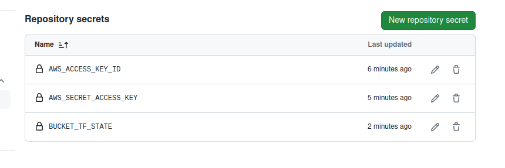
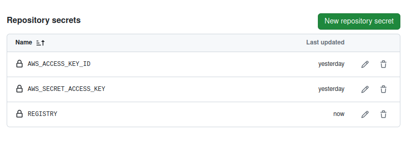

# GitHub Repo Setup


- Log in to your Github account
- Fork the repository: https://github.com/hkhcoder/iac-vprofile to your Github account (Uncheck copy the main branch only)


- Fork one more repository: https://github.com/hkhcoder/vprofile-action to your Github account

- SSH Key Exchange from Local PC to Github account (Upload Public Key to GitHub account)

```
export GIT_SSH_COMMAND="ssh -i ~/.ssh/actions"
```

- Clone the repositories to your local PC

```
git clone git@github.com:minpyaemaw21/vprofile-action.git

git clone git@github.com:minpyaemaw21/iac-vprofile.git

cd vprofile-aciton

git config core.sshCommand "ssh -i ~/.ssh/actions -F /dev/null"

cd iac-vprofile

git config core.sshCommand "ssh -i ~/.ssh/actions -F /dev/null"

git config --global user.email minpyaemaw123@gmail.com

cp -r iac-vprofile main-iac
#clone iac-vprofile to main-iac, for testing pull request to main branch

cd iac-vprofile

git branch -a

git checkout stage

git status
#always change back to stage branch as we are going to make changes in stage branch and then request merge request to main branch

```

Integrating IAM and ECR with GitHub Repos
---

- Create AWS IAM User

> User name: gitops

> Attached Policies: AdministratorAccess

- Get access key and secret access key
- Stick to one region: **ap-southeast-1**
- Copy access key and secret access key to each repository.
- **iac-vprofile > setting > Secrets and variables > New Repository Secret**

> Name: AWS_ACCESS_KEY_ID

> Secret: (Paste access key of IAM User: gitops) 

> Name: AWS_SECRET_ACCESS_KEY

> Secret: (Paste secret access key of IAM User: gitops)

- **vprofile-actions > setting > Secrets and variables > New Repository Secret**

>Name: AWS_ACCESS_KEY_ID

>Secret: (Paste access key of IAM User: gitops)

>Name: AWS_SECRET_ACCESS_KEY

>Secret: (Paste secret access key of IAM User: gitops)

- Create S3 bucket for storing Terraform files

 >Bucket Name: vprofile-actions-mpm

- Create secret repository in iac-vprofile repository

 > Name: BUCKET_TF_STATE

 > Secret: vprofile-actions-mpm
 
-  **iac-vprofile repository sercrets**
 

- Create repository in ECR and get repository URI
- Create secret repository in vprofile-actions
- Remove the suffix /vprofileapp from the URL

>Name: REGISTRY

>Secret: 786428300324.dkr.ecr.ap-southeast-1.amazonaws.com

- **vprofile-actions repository secrets**

