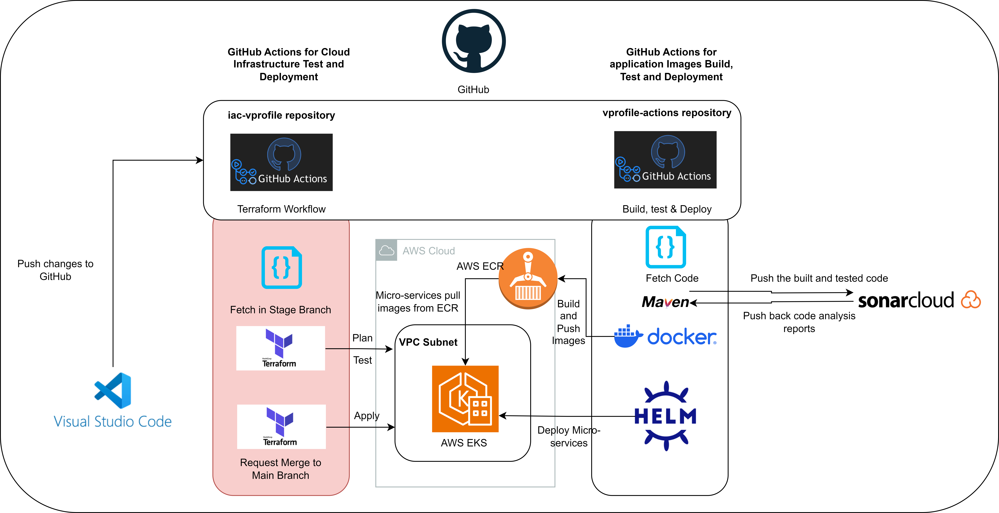
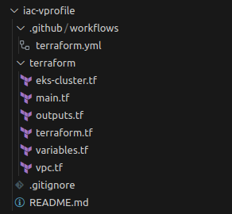

# Terraform Code in iac-vprofile repo
---

The repo to work on : iac-vprofile (highlighted in red, on left side)



Objective
---

To create:

- VPC
- EKS Cluster in AWS

To trigger 
- GitHub Actions workflow when pull request is made to the main branch in Terraform codes, resulting automatic deployment of the cloud infrastructure


Notes

- Only make changes in the stage branch, not in the main branch
- iac-vprofile repository

Terraform Files
---




**Terraform Modules Used for VPC and EKS**


- terraform-aws-modules/vpc/aws

- terraform-aws-modules/eks/aws

terraform.tf

```
terraform {
  required_providers {
    aws = {
      source  = "hashicorp/aws"
      version = "~> 5.25.0"
    }

    random = {
      source  = "hashicorp/random"
      version = "~> 3.5.1"
    }

    tls = {
      source  = "hashicorp/tls"
      version = "~> 4.0.4"
    }

#tls: Used for generating and managing cryptographic keys and certificates, 
#which can be used for securing communications, 
#including within Kubernetes environments.

    cloudinit = {
      source  = "hashicorp/cloudinit"
      version = "~> 2.3.2"
    }
#cloudinit: Used for automating the initialization and configuration of 
#cloud instances at boot time, typically when spinning up 
#new virtual machines or cloud instances.
    
    kubernetes = {
      source  = "hashicorp/kubernetes"
      version = "~> 2.23.0"
    }
  }

#to maintain tfstate file in S3 bucket, not locally
  backend "s3" {
    bucket = "terraform-bucket-mpm"
    key    = "terraform.tfstate"
    region = "ap-southeast-1"
  }

  required_version = "~> 1.6.3"
}

```


variables.tf
```
variable "region" {
  description = "AWS region"
  type        = string
  default     = "ap-southeast-1"
}

variable "clusterName" {
  description = "Name of the EKS cluster"
  type        = string
  default     = "vprofile-eks"
}

```

main.tf
```
provider "kubernetes" {
  host                   = module.eks.cluster_endpoint
  cluster_ca_certificate = base64decode(module.eks.cluster_certificate_authority_data)
}

provider "aws" {
  region = var.region
}

data "aws_availability_zones" "available" {}

locals {
  cluster_name = var.clusterName
}
```

vpc.tf
```
module "vpc" {
  source  = "terraform-aws-modules/vpc/aws"
  version = "5.1.2"

  name = "vprofile-eks"

  cidr = "172.20.0.0/16"
  azs  = slice(data.aws_availability_zones.available.names, 0, 3)

  private_subnets = ["172.20.1.0/24", "172.20.2.0/24", "172.20.3.0/24"]
  public_subnets  = ["172.20.4.0/24", "172.20.5.0/24", "172.20.6.0/24"]

	#for the private subnet
  enable_nat_gateway   = true
	#one nat gateway for all three private subnets
  single_nat_gateway   = true
	#instances launched in that VPC will get DNS names
  enable_dns_hostnames = true

	#Based on the AWS EKS Documentation, need to use the tags below
	#in order to work with EKS Cluster

  public_subnet_tags = {
    "kubernetes.io/cluster/${local.cluster_name}" = "shared"
    "kubernetes.io/role/elb"                      = 1
  }

  private_subnet_tags = {
    "kubernetes.io/cluster/${local.cluster_name}" = "shared"
    "kubernetes.io/role/internal-elb"             = 1
  }
}
```


eks-cluster.tf
```
module "eks" {
  source  = "terraform-aws-modules/eks/aws"
  version = "19.19.1"

  cluster_name    = local.cluster_name
  cluster_version = "1.27"

  vpc_id                         = module.vpc.vpc_id
  subnet_ids                     = module.vpc.private_subnets
  cluster_endpoint_public_access = true

  eks_managed_node_group_defaults = {
    ami_type = "AL2_x86_64"

  }

  eks_managed_node_groups = {
    one = {
      name = "node-group-1"

      instance_types = ["t3.small"]

      min_size     = 1
      max_size     = 3
      desired_size = 2
    }

    two = {
      name = "node-group-2"

      instance_types = ["t3.small"]

      min_size     = 1
      max_size     = 2
      desired_size = 1
    }
  }
}
```

output.tf
```
output "cluster_name" {
  description = "Amazon Web Service EKS Cluster Name"
  value       = module.eks.cluster_name
}

output "cluster_endpoint" {
  description = "Endpoint for Amazon Web Service EKS "
  value       = module.eks.cluster_endpoint
}

output "region" {
  description = "Amazon Web Service EKS Cluster region"
  value       = var.region
}


output "cluster_security_group_id" {
  description = "Security group ID for the Amazon Web Service EKS Cluster "
  value       = module.eks.cluster_security_group_id
}

```


- Update desired EKS Cluster name and Region in variables.tf

- Update desired Bucket Name and Region in terraform.tf

- Then commit and push.


VPC Module Explanation
---

This Terraform configuration is defining a Virtual Private Cloud (VPC) on AWS using a popular module from the Terraform Registry (`terraform-aws-modules/vpc/aws`). Let's break down the code and explain each part, especially focusing on the NAT Gateway and subnet tags.

### 1. **Module Configuration**

- **`module "vpc"`**: The code defines a module called "vpc" that uses the `terraform-aws-modules/vpc/aws` module version 5.1.2 from the Terraform Registry.
- **`name`**: The name of the VPC is set to "vprofile-eks".
- **`cidr`**: The VPC has a CIDR block of `172.20.0.0/16`, which defines the range of IP addresses available within the VPC.
- **`azs`**: Availability Zones are selected using the `slice` function to pick the first three available zones.

### 2. **Subnets**

- **Private Subnets**: These are defined with the IP ranges `172.20.1.0/24`, `172.20.2.0/24`, and `172.20.3.0/24`. These subnets are not directly accessible from the internet and are often used for internal resources like databases.
- **Public Subnets**: These are defined with the IP ranges `172.20.4.0/24`, `172.20.5.0/24`, and `172.20.6.0/24`. Public subnets are accessible from the internet and are used for resources that need to be exposed publicly, such as load balancers or NAT Gateways.

### 3. **NAT Gateway**

- **`enable_nat_gateway = true`**: This enables the creation of a NAT Gateway in the VPC.
- **`single_nat_gateway = true`**: This configures a single NAT Gateway for the entire VPC.
- **Purpose of NAT Gateway**:
    - NAT Gateways allow instances in private subnets to connect to the internet or other AWS services, but they prevent inbound connections initiated from the internet. This is useful for securing instances that don't need to be directly accessible from the internet while still allowing them to download updates or communicate with external services.

### 4. **DNS Hostnames**

- **`enable_dns_hostnames = true`**: This enables DNS hostnames in the VPC, which is useful for resolving IP addresses to names, particularly when working with services like EC2.

### 5. **Subnet Tags**

- **Public Subnet Tags**:
    - **`"kubernetes.io/cluster/${local.cluster_name}" = "shared"`**: This tag is used by Kubernetes to identify the subnets that should be used for resources related to the cluster. The `${local.cluster_name}` variable is likely defined elsewhere in the Terraform configuration.
    - **`"kubernetes.io/role/elb" = 1`**: This tag designates the subnet as eligible for Elastic Load Balancers (ELB), which Kubernetes can use to expose services to the internet.
- **Private Subnet Tags**:
    - **`"kubernetes.io/cluster/${local.cluster_name}" = "shared"`**: Similarly, this tag is used by Kubernetes to identify private subnets for the cluster.
    - **`"kubernetes.io/role/internal-elb" = 1`**: This tag indicates that the subnet is suitable for internal ELBs, which are used for services that should only be accessible within the VPC.

### **Why NAT Gateway and Subnet Tags Are Needed:**

1. **NAT Gateway**:
    - **Security**: It allows instances in private subnets to access the internet for updates or communication with other AWS services without exposing them to inbound traffic from the internet.
    - **Cost Efficiency**: Using a single NAT Gateway is more cost-effective than deploying multiple ones, especially in a small or medium-sized setup.
2. **Subnet Tags**:
    - **Kubernetes Integration**: The tags are essential for integrating the VPC with Kubernetes, specifically with services like Amazon EKS (Elastic Kubernetes Service). Kubernetes uses these tags to determine which subnets should be used for deploying resources, such as load balancers and nodes.
    - **Automatic Configuration**: By tagging the subnets appropriately, Kubernetes can automatically configure resources like load balancers to use the correct subnets, streamlining the deployment process.

This Terraform configuration is well-suited for deploying an Amazon EKS cluster, with secure, properly configured networking.

EKS Module Explanation
---

- **Node Group** = Logical grouping of Kubernetes worker nodes (EC2 instances).
- **Auto Scaling Group (ASG)** = AWS service that manages the scaling of the instances in the node group.
- **Nodes** (EC2 instances) = The actual machines where your Kubernetes workloads run.