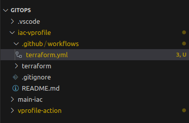
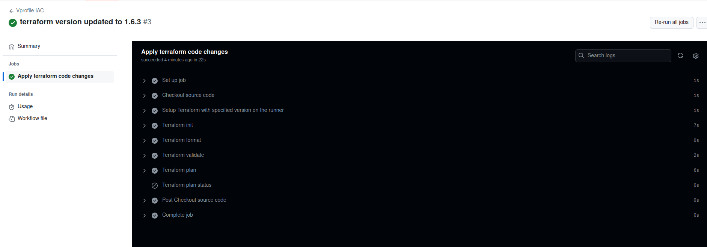

# Staging Workflow for Terraform Code by GitHub Actions
---

Create the GitHub actions workflow in the repository **iac-vprofile**

```
cd iac-vprofile
mkdir -p .github/workflows
cd .github/workflows
touch terraform.yml
```



terraform.yml
```
name: "Vprofile IAC"
#when should the workflow get started
#the workflow will get started when code changes are pushed to the main and stage branch
on:
    push:
        branches:
            - main
            - stage
        paths:
            - terraform/**
    pull_request:
        branches:
            - main
        paths:
            - terraform/**

env:
  #Credentials for deployment to AWS, from the repository secrets
  AWS_ACCESS_KEY_ID: ${{ secrets.AWS_ACCESS_KEY_ID }}
  AWS_SECRET_ACCESS_KEY: ${{ secrets.AWS_SECRET_ACCESS_KEY }}
  #S3 bucket for the terraform state
  BUCKET_TF_STATE: ${{ secrets.BUCKET_TF_STATE }}
  AWS_REGION: ap-southeast-1
  EKS_CLUSTER: vprofile-eks

jobs: #like build from jenkins
    terraform:
        name: "Apply terraform code changes"
        runs-on: ubuntu-latest #runners, but containers
        defaults: #what default thing to use when the job is running
            run:
                shell: bash
                working-directory: ./terraform #run bash shell from tha directory

        steps: #steps are like stages from jenkins, like tasks from ansible
            - name: Checkout source code
              uses: actions/checkout@v4 #pre-defined actions stored in the market place
              
              #if terraform is not pre-buiilt into ubuntu-latest, need to set up
            - name: Setup Terraform with specified version on the runner 
              uses: hashicorp/setup-terraform@v2 #action version
              #with:
               # terraform_version: 1.6.3 
               #selecting the specific version of terrform, 
               #if not select the latest version will be installed

            - name: Terraform init
              id: init
              run: terraform init -backend-config="bucket=$BUCKET_TF_STATE"
            
            - name: Terraform format
              id: fmt
              run: terraform fmt -check 
              #if the format is not correct and return non-zero code, 
              #the workflow will fail
            
            - name: Terraform validate
              id: validate
              run: terraform validate 
              #check the syntax of the terraform code
            
            - name: Terraform plan
              id: plan
              run: terraform plan -no-color -input=false -out planfile
              #output terraform plan results to planfile which will be used to apply 
              #without inputting "yes"
              continue-on-error: true
              #continue to process the next step even if there is error
            
            - name: Terraform plan status
              if: steps.plan.outcome == 'failure'
              run: exit 1 #will stop the workflow
            
            
```

***
### pull_request:

A pull request is essentially a request to pull (i.e., merge) changes from one branch into another branch, typically from a feature branch into `main`. It's a crucial part of collaborative development, enabling code review, testing, and discussion before merging changes into the main code base.

### checkout:

The **checkout** step is essential in a GitHub Actions workflow because it retrieves the repository's source code and makes it available in the runner's environment. This allows the workflow to perform tasks like running Terraform commands, building the project, running tests, or deploying code. Without this step, the workflow wouldn’t have the necessary context or files to execute its tasks.
***

- Commit and push terraform.yml to the repository
- Test the workflow by making changes in the repository and push to the remote repository.
- The workflow started showing up in Actions tab.
- Image
- I have issue with Terraform Versions, so I use 1.6.3 and the workflow stared working.
- Until now, "Terraform Plan" will only be executed when there are code pushes to main and stage 


