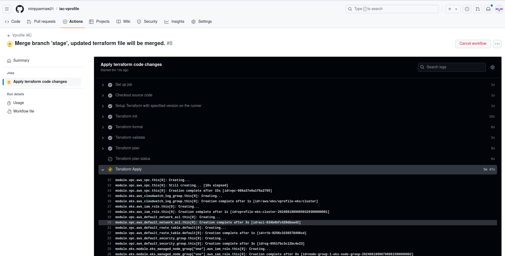
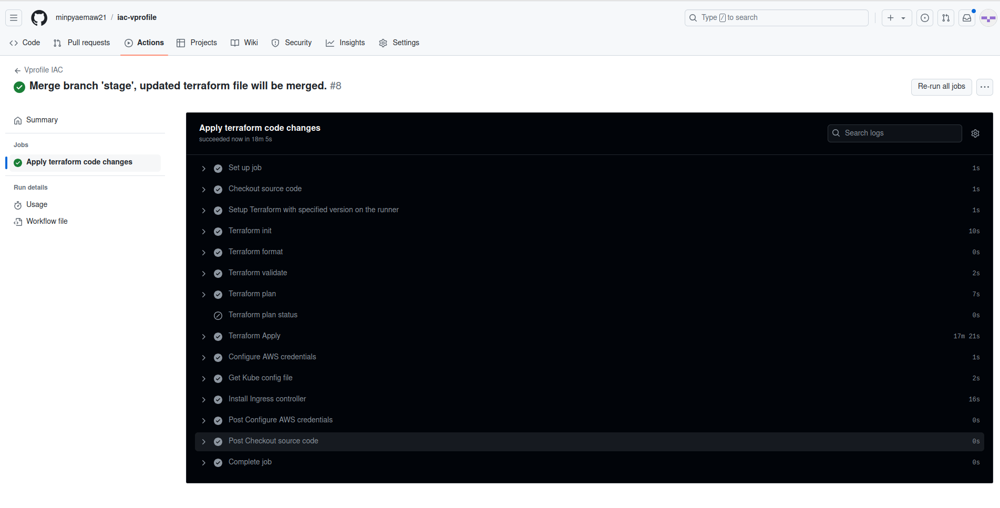
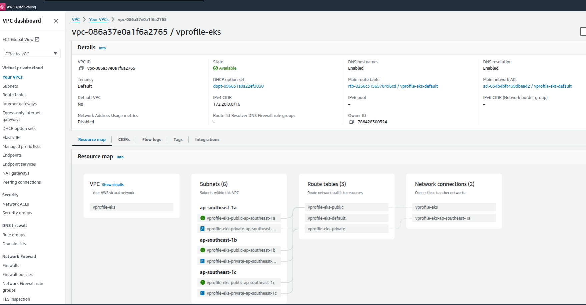
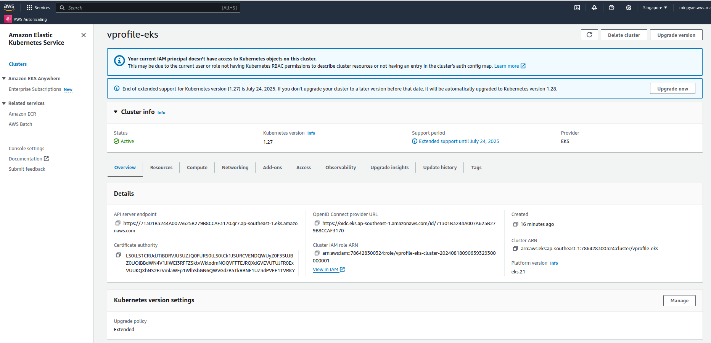
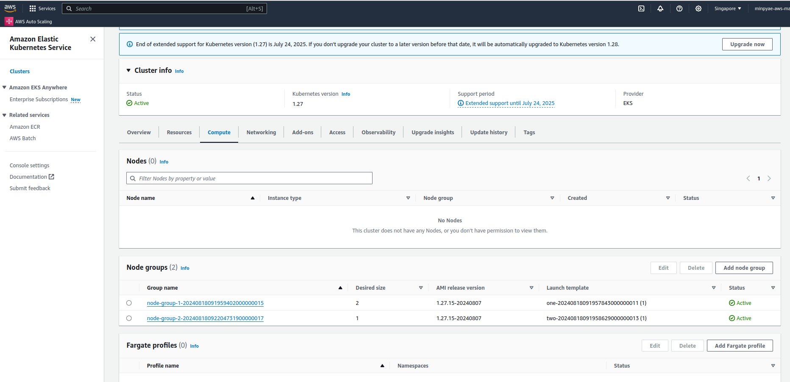
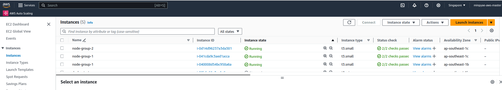

# Main Workflow for Terraform CODE

The following changes are added to the workflow file:

- **Terraform Apply**: Added a step to automatically apply Terraform configuration when a push is made to the main branch. The process runs without manual input, ensuring a sequential execution and applying the contents of the specified plainfile.
- **AWS Credentials Configuration**: Added AWS credentials configuration to authenticate with AWS using access key and secret access key. This is necessary for the next step to generate the Kubernetes config file.

- **Generate KubeConfig File**: Added KubeConfig file generation step after successful Terraform apply. This file is required to interact with the EKS cluster, allowing for Kubernetes commands like kubectl to be executed.

- **Ingress Controller Installation**: Added Nginx Ingress Controller installation step. This will deploy the ingress controller on the EKS cluster, but only after successful Terraform apply and KubeConfig file generation.

terraform.yml

```
name: "Vprofile IAC"
#when should the workflow get started
on:
    push:
        branches:
            - main
            - stage
        paths:
            - terraform/**
    pull_request:
        branches:
            - main
        paths:
            - terraform/**

env:
  #Credentials for deployment to AWS
  AWS_ACCESS_KEY_ID: ${{ secrets.AWS_ACCESS_KEY_ID }}
  AWS_SECRET_ACCESS_KEY: ${{ secrets.AWS_SECRET_ACCESS_KEY }}
  #S3 bucket for the terraform state
  BUCKET_TF_STATE: ${{ secrets.BUCKET_TF_STATE }}
  AWS_REGION: ap-southeast-1
  EKS_CLUSTER: vprofile-eks

jobs: #like build from jenkins
    terraform:
        name: "Apply terraform code changes"
        runs-on: ubuntu-latest #runners, but containers
        defaults: #what default thing to use when the job is running
            run:
                shell: bash
                working-directory: ./terraform #run bash shell from tha directory

        steps: #steps are like stages from jenkins, like tasks from ansible
            - name: Checkout source code
              uses: actions/checkout@v4 #pre-defined actions stored in the market place
            
            - name: Setup Terraform with specified version on the runner
              uses: hashicorp/setup-terraform@v3 #action version
              with:
                terraform_version: 1.6.3 #selecting the specific version of terrform, if not select the latest version will be installed

            - name: Terraform init
              id: init
              run: terraform init -backend-config="bucket=$BUCKET_TF_STATE"
            
            - name: Terraform format
              id: fmt
              run: terraform fmt -check #if the format is not correct, the workflow will fail
            
            - name: Terraform validate
              id: validate
              run: terraform validate #check the syntax of the terraform code
            
            - name: Terraform plan
              id: plan
              run: terraform plan -no-color -input=false -out planfile
              continue-on-error: true
            
            - name: Terraform plan status
              if: steps.plan.outcome == 'failure'
              run: exit 1 #will stop the workflow
            
            - name: Terraform Apply
              id: apple
              if: github.ref == 'refs/heads/main' && github.event_name == 'push'
              run: terraform apply -auto-approve -input=false -parallelism=1 plainfile 
              #no need to input yes, no parallel run, applying the contet of plainfile

            - name: Configure AWS credentials
              uses: aws-actions/configure-aws-credentials@v1
              with:
                aws-access-key-id: ${{ secrets.AWS_ACCESS_KEY_ID }}
                aws-secret-access-key: ${{ secrets.AWS_SECRET_ACCESS_KEY }}
                aws-region: ${{ env.AWS_REGION }}
              #AWS Access keys and Secret Access Key are necessary 
              #to generate KubeConfig file below   
                
            - name: Get Kube config file
              id: getconfig
              if: steps.apple.outcome == 'success'
              run: aws eks update-kubeconfig --region ${{ env.AWS_REGION }} --name ${{ env.EKS_CLUSTER }} 
              #KubeConfig file is necessary to deploy Nginx Ingress Controller
              #and to run kubectl commands
              #By now, required aws infrastruture (VPC and EKS) already created
              #by terraform apply, so Nginx Ingress Controller will be installed
              #if terraform apply and KubeConfig generation was successful
              
            - name: Install Ingress controller
              if: steps.apple.outcome == 'success' && steps.getconfig.outcome == 'success'
              run: kubectl apply -f https://raw.githubusercontent.com/kubernetes/ingress-nginx/controller-v1.1.3/deploy/static/provider/aws/deploy.yaml
```

- Commit and push the changes.
- Testing
```
#Go to the cloned repository of iac-vprofile
cd main-iac

git status

On branch main
Your branch is up to date with 'origin/main'.

nothing to commit, working tree clean

git pull
git checkout stage

git checkout main
Switched to branch 'main'
Your branch is up to date with 'origin/main'.

git merge stage #in production, main branch will be locked

Merge made by the 'ort' strategy.
 .github/workflows/terraform.yml | 83 +++++++++++++++++++++++++++++++++++++++++
 terraform/terraform.tf          |  4 +-
 terraform/variables.tf          |  7 +++-
 3 files changed, 90 insertions(+), 4 deletions(-)
 create mode 100644 .github/workflows/terraform.yml
 
 
git push origin main
Enumerating objects: 1, done.
Counting objects: 100% (1/1), done.
Writing objects: 100% (1/1), 230 bytes | 230.00 KiB/s, done.
Total 1 (delta 0), reused 0 (delta 0), pack-reused 0
To github.com:minpyaemaw21/iac-vprofile.git
   45d654e..ab4fa73  main -> main

```

After merging to the main branch, the workflow will start triggering and will create AWS Resources by Terraform Code.



The workflow finally completed.



- After 10 or 15 minutes later, verify the results in AWS Management Console.

**VPC (Subnets, NAT Gateway,..)**

**EKS Cluster**

**Cluster Node Groups**

**Nodes**


- We can set blocking or request for approval to the main branch in the repository setting.

>   GitHub> iac-vprofile > setting > Branches > Add branch protection rule
> 
>   Branch Name Pattern: **main**
> 
>   Tick “**Require a pull request before merging**”

- If the approval request is set for the main branch, we need to create pull request, to be reviewed by the admin and if the admin approves, the merge will be made and then the workflow will start triggering.
- In production, there should be a test environment for the staging branch to apply.