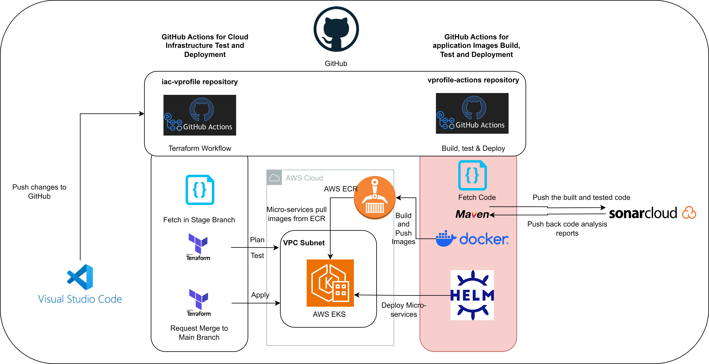
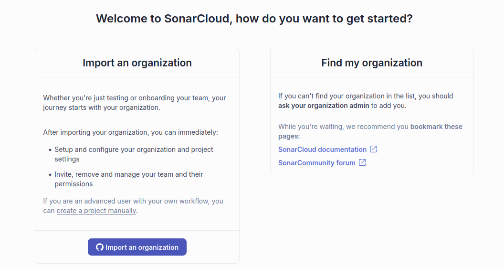
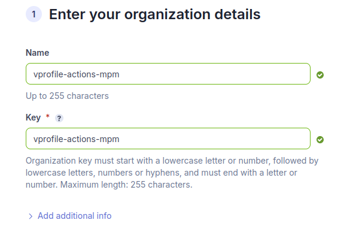
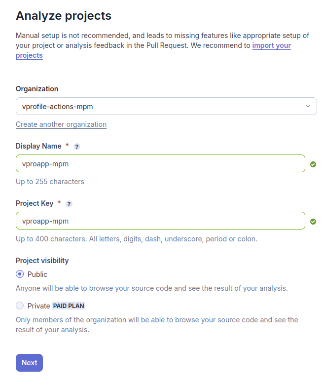
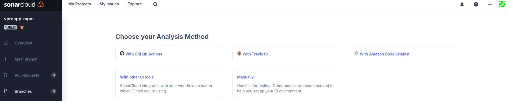
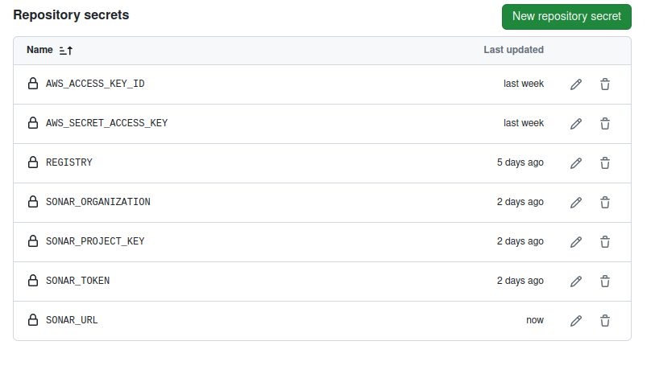

# Integarting SonarCloud with GitHub

- The repo to work on: **vprofile-actions** (on the right side, highlighted in red)

***
- Please note Organization Key, Project Key and Token you will get from [www.sonarcloud.io](http://www.sonarcloud.io), to input in GitHub as secrets.
- Go to SonarCloud, create the organization, project and token and store it on GitHub Secrets
- Go to [www.sonarcloud.io](http://www.sonarcloud.io) and log in with GitHub account.
- Create a project manually > Create Organization

- Analyze Project>
    
    (will need organization name and project key to fill in GitHub secrets)
    
>    Organization: vprofile-actions-mpm 
>     
>    Display Name: vproapp-mpm
>     
>    Project Key: vproapp-mpm
>     
>    Project Visibility: Public

- Select “The new code for this project will be based on:” **Previous Version**

- Then create the project.

- Create token for GitHub in the setting.

>    **My Account > Security > Generate Tokens.**
> 
>    Save the generated tokens in a secure place.
> 
>    (will need token to fill in GitHub secrets)

- Go to vprofile-action repository in GitHub.

**Settings> secrets and variables> Actions > New Repository Secret**

> Name: SONAR_TOKEN
> 
> Secret: Token Generated by SonarCloud project

New Repository Secret

> Name: SONAR_ORGANIZATION

> Fill Organization Name of SonarCloud Project

> Secret: vproifile-actions-mpm 

New Repository Secret

> Name: SONAR_PROJECT_KEY

> Fill Project Key of SonarCloud Organization

> Secret: vproapp-mpm

New Repository Secret

> Name: SONAR_URL
> Secret: https://sonarcloud.io

List of repository secrets in vprofile-action repository

---

