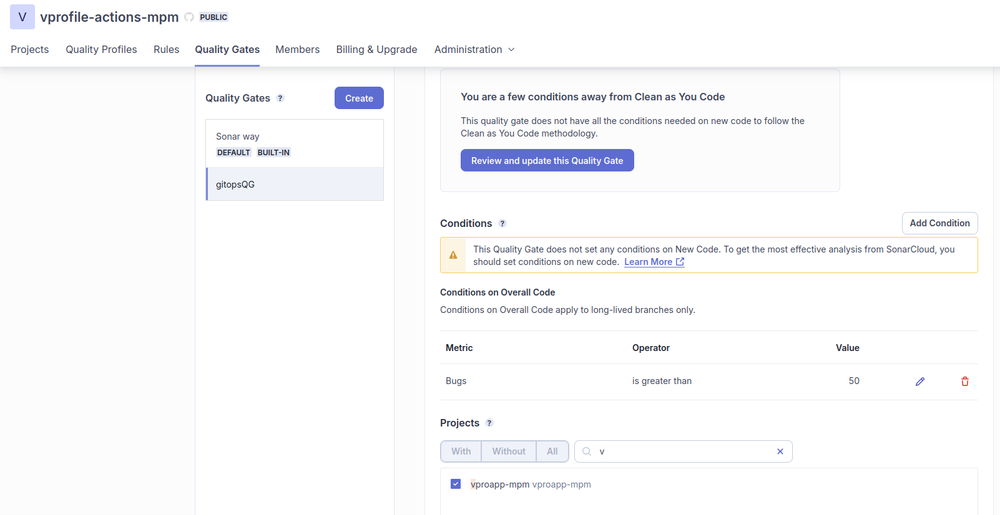

# Workflow for APP CODE
---
- Open vprofile-action repo in Visual Studio Code.


## Application Architecture Overview


Above architecture is prepared in Kubernetes Definition Files to be deployed on the Kubernetes Cluster.

The following images **minpyaemaw/vproapp and minpyaemaw/vprodb**, used in the deployment of **Tomcat Server and DB Server** are already prepared in my dockerhub.

Kubernetes Definition Files
---

Secrets for database connection and rabbit Mq, encoded in base64

app-secret.yml
```
apiVersion: v1
kind: Secret
metadata:
  name: app-secret
type: Opaque
data:
  db-pass: dnByb2RicGFzcw== 
  rmq-pass: Z3Vlc3Q=
```

Cluster IP type Service for Memcached

mc-CIP.yml
```
apiVersion: v1
kind: Service
metadata:
  name: vprocache01
spec:
  ports:
  - port: 11211
    targetPort: vpromc-port
    protocol: TCP
  selector:
    app: vpromc 
  type: ClusterIP

```
Memcached Deployment

mcdep.yml
```
apiVersion: apps/v1
kind: Deployment
metadata:
  name: vpromc
  labels:
    app: vpromc
spec:
  selector:
    matchLabels:
      app: vpromc
  replicas: 1
  template:
    metadata:
      labels:
        app: vpromc
    spec:
      containers:
      - name: vpromc
        image: memcached
        ports:
        - name: vpromc-port
          containerPort: 11211

```

Cluster IP type service for RabbitMQ

rmq-CIP-service.yml
```
apiVersion: v1
kind: Service
metadata:
  name: vpromq01
spec:
  ports:
  - port: 5672
    targetPort: vpromq01-port
    protocol: TCP
  selector:
    app: vpromq01
  type: ClusterIP


```

RabbitMQ Deployment

rmq-dep.yml
```
apiVersion: apps/v1
kind: Deployment
metadata:
  name: vpromq01
  labels:
    app: vpromq01
spec:
  selector:
    matchLabels:
      app: vpromq01
  replicas: 1
  template:
    metadata:
      labels:
        app: vpromq01
    spec:
      containers:
      - name: vpromq01
        image: rabbitmq
        ports:
        - name: vpromq01-port
          containerPort: 15672
        env: 
         - name: RABBITMQ_DEFAULT_PASS
           valueFrom:
             secretKeyRef:
               name: app-secret
               key: rmq-pass
         - name: RABBITMQ_DEFAULT_USER
           value: "guest"


```
Cluster IP type Service for Vproapp (Tomcat) 

vproapp-service.yml
```
apiVersion: v1
kind: Service
metadata:
  name: my-app
spec:
  ports:
  - port: 8080
    protocol: TCP
    targetPort: 8080
  selector:
    app: vproapp
  type: ClusterIP

```
Vproapp Deployment

vproappdep.yml
```
apiVersion: apps/v1
kind: Deployment
metadata:
  name: vproapp
  labels: 
    app: vproapp
spec:
  replicas: 1
  selector:
    matchLabels:
      app: vproapp
  template:
    metadata:
      labels:
        app: vproapp
    spec:
      containers:
      - name: vproapp
        image: minpyaemaw/vprofileapp
        ports:
        - name: vproapp-port
          containerPort: 8080
      initContainers:
      - name: init-mydb
        image: busybox
        command: ['sh', '-c', 'until nslookup vprodb.$(cat /var/run/secrets/kubernetes.io/serviceaccount/namespace).svc.cluster.local; do echo waiting for mydb; sleep 2; done;']
      - name: init-memcache
        image: busybox
        command: ['sh', '-c', 'until nslookup vprocache01.$(cat /var/run/secrets/kubernetes.io/serviceaccount/namespace).svc.cluster.local; do echo waiting for mydb; sleep 2; done;']

```
Cluster IP type service for MySQL DB

db-CIP.yml
```
apiVersion: v1
kind: Service
metadata:
  name: vprodb
spec:
  ports:
  - port: 3306
    targetPort: vprodb-port
    protocol: TCP
  selector:
    app: vprodb
  type: ClusterIP

```
MySQL Deployment
vprodbdep.yml

```
apiVersion: apps/v1
kind: Deployment
metadata:
  name: vprodb
  labels:
    app: vprodb
spec:
  selector:
    matchLabels:
      app: vprodb
  replicas: 1
  template:
    metadata:
      labels:
        app: vprodb
    spec:
      containers:
      - name: vprodb
        image: minpyaemaw/vprofiledb 
        ports:
        - name: vprodb-port
          containerPort: 3306
        env: 
         - name: MYSQL_ROOT_PASSWORD
           valueFrom:
             secretKeyRef:
               name: app-secret
               key: db-pass
#        env:
#         - name: MYSQL_ROOT_PASSWORD
#           value: "vprodbpass"


```

Ingress for the Nginx Ingress Controller

vproingress.yml
```
apiVersion: networking.k8s.io/v1
kind: Ingress
metadata:
  name: vpro-ingress
  annotations:
    nginx.ingress.kubernetes.io/use-regex: "true"
    #this annotations is important as it descrbies to use 
    #Nginx ELB
spec:
  ingressClassName: nginx
  rules:
  - host: vprofile.minpyae.xyz 
  #using my domain from GoDaddy
  #this domain will point to Nginx ELB DNS Name
    http:
      paths:
      - path: /
        pathType: Prefix
        backend:
          service:
            name: my-app
            port:
              number: 8080
```

Building the source code (Business Logic) by

Dockerfile
```
FROM openjdk:11 AS BUILD_IMAGE
RUN apt update && apt install maven -y
COPY ./ vprofile-project
RUN cd vprofile-project &&  mvn install 

FROM tomcat:9-jre11
LABEL "Project"="Vprofile"
LABEL "Author"="Imran"
RUN rm -rf /usr/local/tomcat/webapps/*
COPY --from=BUILD_IMAGE vprofile-project/target/vprofile-v2.war /usr/local/tomcat/webapps/ROOT.war

EXPOSE 8080
CMD ["catalina.sh", "run"]

```

As **the nginx ingress controller** was already created, we can create the ingress rules

In vproingress.yml, replace the host name with **your own domain name**

```
apiVersion: networking.k8s.io/v1
kind: Ingress
metadata:
  name: vpro-ingress
  annotations:
    nginx.ingress.kubernetes.io/use-regex: "true"
    #this annotations is important as it descrbies to use 
    #Nginx ELB
spec:
  ingressClassName: nginx
  rules:
  - host: vprofile.minpyae.xyz #using my domain from GoDaddy
    http:
      paths:
      - path: /
        pathType: Prefix
        backend:
          service:
            name: my-app
            port:
              number: 8080
```

We will use Helm Charts for using variables.

Let’s create the workflow in the repository.


```
cd vprofile-action
mkdir -p .github/workflows
cd .github/workflows
touch main.yml
```

main.yml
```
name: vprofile actions
on:
  push:
    branches:
      - main
    paths:
      - kubernetes/**
#can add condition in real time for code changes
env:
    AWS_REGION: ap-southeast-1
    ECR_REPOSITORY: vprofileapp #from AWS
    EKS_CLUSTER: vprofile-eks
jobs:
    Testing:
        runs-on: ubuntu-latest #comes with maven, so no need to install maven
        steps:
            - name: Code checkout
              uses: actions/checkout@v4
            
            - name: Maven test
              run: mvn test
            
            - name: Checkstyle
              run: mvn checkstyle:checkstyle

            # Setup java 11 to be default (sonar-scanner requirement as of 5.x)
            - name: Set Java 11
              uses: actions/setup-java@v3
              with:
                distribution: 'temurin'
                java-version: '11'
                #See Supported distributions for available

            # Setup sonar-scanner CLI to communicate SonarCloud
            - name: Setup SonarQube
              uses: warchant/setup-sonar-scanner@v7

            # Run sonar-scanner\
            - name: SonarQube Scan
              run: sonar-scanner
                -Dsonar.host.url=${{ secrets.SONAR_URL }}
                -Dsonar.login=${{ secrets.SONAR_TOKEN }}
                -Dsonar.organization=${{ secrets.SONAR_ORGANIZATION }}
                -Dsonar.projectKey=${{ secrets.SONAR_PROJECT_KEY }}
                -Dsonar.sources=src/
                -Dsonar.junit.reportsPath=target/surefire-reports/
                -Dsonar.jacoco.reportsPath=target/jacoco.exec
                -Dsonar.java.checkstyle.reportPaths=target/checkstyle-result.xml
                -Dsonar.java.binaries=target/test-classes/com/visualpathit/account/controllerTest/ 

            #If the Quality Gate is not specified, default will be sued
            #If got error, crate new Quality Gate and trigger the workflow again
            # Check the Quality Gate status.
            - name: SonarQube Quality Gate check
              id: sonarqube-quality-gate-check
              uses: sonarsource/sonarqube-quality-gate-action@master
              # Force to fail step after specific time.
              timeout-minutes: 5
              env:
                SONAR_TOKEN: ${{ secrets.SONAR_TOKEN }}
                SONAR_HOST_URL: ${{ secrets.SONAR_URL }} #OPTIONAL

```


- Commit and push to GitHub Repo.
- GitHub > vprofile-aciton >  Actions > Run workflow or push changes in kubernetes directory to trigger the workflow

The workflow starts triggering.


- Check the default **Quality Gate** in SonarCloud
 
    **Administration > Quality Gate> Default: Sonar Way**
 
- If you encounter Quality Gate error while running the workflow, create and attach new Quality Gate manually to the project in SonarCloud and run the workflow again.


- Create New Quality Gate>

> Name: **gitopsQG**
> 
> Add Condition: 
> 
> **Where? : On Overall Code**
> 
> **Quality Gate fails when: Bugs**
> 
> **Operator (is greater than): 50**

- Attach to the project: **vproapp-mpm**



As long as the results are aligned with the conditions defined, Quality Gates pass the analysis.

