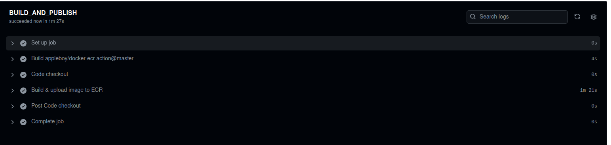
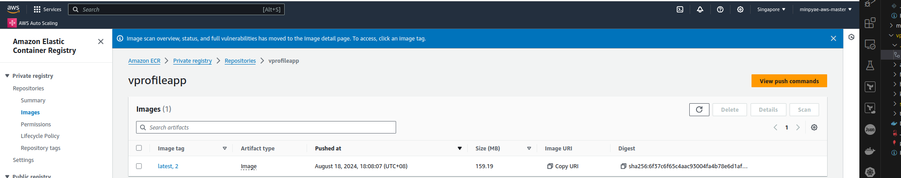

# Build Image by Docker and Publish to ECR

We will use **docker-ecr** by **appleboy** to upload docker image to **Amazon Elastic Container Registry (ECR)**

https://github.com/marketplace/actions/docker-ecr

Added a new job: BUILD_AND_PUBLISH to build image and publish to ECR.

main.yml
```
name: vprofile actions
on: workflow_dispatch #manually trigger the workflow
env:
    AWS_REGION: ap-southeast-1
    ECR_REPOSITORY: vprofileapp
    EKS_CLUSTER: vprofile-eks
jobs:
    Testing:
        runs-on: ubuntu-latest #comes with maven, so no need to install maven
        steps:
            - name: Code checkout
              uses: actions/checkout@v4
            
            - name: Maven test
              run: mvn test
            
            - name: Checkstyle
              run: mvn checkstyle:checkstyle

            # Setup java 11 to be default (sonar-scanner requirement as of 5.x)
            - name: Set Java 11
              uses: actions/setup-java@v3
              with:
                distribution: 'temurin' #See Supported distributions for available
                java-version: '11'

            # Setup sonar-scanner CLI to communicate SonarCloud
            - name: Setup SonarQube
              uses: warchant/setup-sonar-scanner@v7

            # Run sonar-scanner, all reports and results will be uploaded to the SonarCloud
            - name: SonarQube Scan
              run: sonar-scanner
                -Dsonar.host.url=${{ secrets.SONAR_URL }}
                -Dsonar.login=${{ secrets.SONAR_TOKEN }}
                -Dsonar.organization=${{ secrets.SONAR_ORGANIZATION }}
                -Dsonar.projectKey=${{ secrets.SONAR_PROJECT_KEY }}
                -Dsonar.sources=src/
                -Dsonar.junit.reportsPath=target/surefire-reports/
                -Dsonar.jacoco.reportsPath=target/jacoco.exec
                -Dsonar.java.checkstyle.reportPaths=target/checkstyle-result.xml
                -Dsonar.java.binaries=target/test-classes/com/visualpathit/account/controllerTest/ 

            # Check the Quality Gate status.
            - name: SonarQube Quality Gate check
              id: sonarqube-quality-gate-check
              uses: sonarsource/sonarqube-quality-gate-action@master
              # Force to fail step after specific time.
              timeout-minutes: 5
              env:
                SONAR_TOKEN: ${{ secrets.SONAR_TOKEN }}
                SONAR_HOST_URL: ${{ secrets.SONAR_URL }} #OPTIONAL

    BUILD_AND_PUBLISH:
      needs: Testing
      runs-on: ubuntu-latest
      steps:
        - name: Code checkout
          uses: actions/checkout@v4 
        
        - name: Build & upload image to ECR
          uses: appleboy/docker-ecr-action@master
          with:
            access_key: ${{ secrets.aws_access_key_id }}
            secret_key: ${{ secrets.aws_secret_access_key }}
            registry: ${{ secrets.registry }} #Repository URL
            cache_from: ${{ secrets.cache }}
            repo: ${{ env.ECR_REPOSITORY }} #Repository Name
            region: ${{ env.AWS_REGION }}
            tags: latest, ${{ github.run_number }} #Build ID
            daemon_off: false
            dockerfile: ./Dockerfile #Docker file location
            context: ./ #current working directory
    
```


- Commit and push to the repository,
- Then run the workflow in GitHub.



After the job is finished, go and check the image in AWS ECR repository. 



We will see that the image is built with the latest build tag.

When there is the code changed, the code will be tested, a new image will be generated if      everything checkouts fine.

