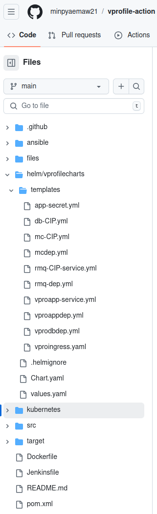
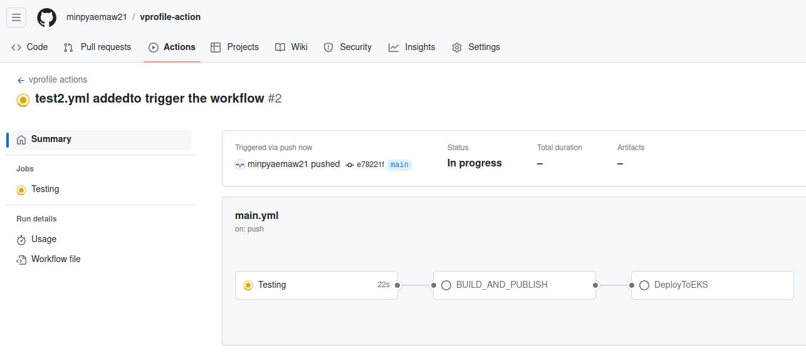
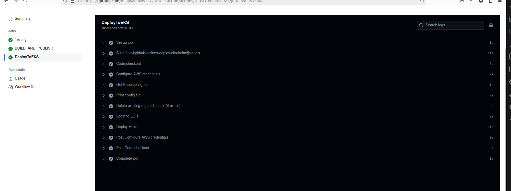
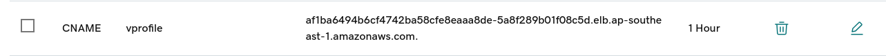

# Using Helms Charts to Deploy Kubernetes Definition Files to EKS

Helm is used for: 

1. Templatization
2. Package Management

- Install Helm on your Ubuntu

      https://helm.sh/docs/intro/install/

- Go to the vprofile-actions repository directory and create helm chart
```
cd vprofile-actions
helm create vprofilecharts
```

Complete suit of application is called chart

```
mkdir helm
mv vprofilecharts helm/
#remove all default templates
rm -rf helm/vprofilecharts/templates/*
#copy all definition files to templates directory
cp kubernetes/vpro-app/* helm/vprofilecharts/templates/
ls helm/vprofilecharts/templates/
cd helm/vprofilecharts/templates
```



- appimage is dynamically set to the ECR repository URL and repo name by combining ${{ secrets.REGISTRY }} (ECR registry URL) with ${{ env.ECR_REPOSITORY }} (repository name).
- apptag is set to the current GitHub Actions run number ${{ github.run_number }}, which provides a unique tag for each image build.
- These values are passed to the Helm chart, where the image is referenced as {{ .Values.appimage }}:{{ .Values.apptag }}, ensuring the correct image and tag are deployed.


```
      - name: vproapp
        image: {{ .Values.appimage }}:{{ .Values.apptag }}
        ports:
   
```

```
        - name: Deploy Helm
          uses: bitovi/github-actions-deploy-eks-helm@v1.2.8
          with:
            aws-access-key-id: ${{ secrets.AWS_ACCESS_KEY_ID }}
            aws-secret-access-key: ${{ secrets.AWS_SECRET_ACCESS_KEY }}
            aws-region: ${{ env.AWS_REGION }}
            cluster-name: ${{ env.EKS_CLUSTER }}
            #config-files: .github/values/dev.yaml
            chart-path: helm/vprofilecharts
            namespace: default
            values: appimage=${{ secrets.REGISTRY }}/${{ env.ECR_REPOSITORY }},apptag=${{ github.run_number }}
            name: vprofile-stack #Release Name
```  
    
    
vproappdep.yml
```

apiVersion: apps/v1
kind: Deployment
metadata:
  name: vproapp
  labels: 
    app: vproapp
spec:
  replicas: 1
  selector:
    matchLabels:
      app: vproapp
  template:
    metadata:
      labels:
        app: vproapp
    spec:
      containers:
      - name: vproapp
        image: {{ .Values.appimage }}:{{ .Values.apptag }}
        ports:
        - name: vproapp-port
          containerPort: 8080
      initContainers:
      - name: init-mydb
        image: busybox
        command: ['sh', '-c', 'until nslookup vprodb.$(cat /var/run/secrets/kubernetes.io/serviceaccount/namespace).svc.cluster.local; do echo waiting for mydb; sleep 2; done;']
      - name: init-memcache
        image: busybox
        command: ['sh', '-c', 'until nslookup vprocache01.$(cat /var/run/secrets/kubernetes.io/serviceaccount/namespace).svc.cluster.local; do echo waiting for mydb; sleep 2; done;']

```

- Added a new job: DeployToEKS to deploy resources to EKS.
- Trigger workflow on changes in specific path.
This configuration automatically triggers the workflow when changes are pushed to 
the path 'helm/vprofilecharts/templates', eliminating the need for manual execution.


.github/workflows/main.yml
```
name: vprofile actions
on:
  workflow_dispatch:
  push:
    paths:
      - helm/vprofilecharts/templates/**

env:
    AWS_REGION: ap-southeast-1
    ECR_REPOSITORY: vprofileapp
    EKS_CLUSTER: vprofile-eks

jobs:
    Testing:
        runs-on: ubuntu-latest #comes with maven, so no need to install maven
        steps:
            - name: Code checkout
              uses: actions/checkout@v4
            
            - name: Maven test
              run: mvn test
            
            - name: Checkstyle
              run: mvn checkstyle:checkstyle

            # Setup java 11 to be default (sonar-scanner requirement as of 5.x)
            - name: Set Java 11
              uses: actions/setup-java@v3
              with:
                distribution: 'temurin' #See Supported distributions for available
                java-version: '11'

            # Setup sonar-scanner CLI to communicate SonarCloud
            - name: Setup SonarQube
              uses: warchant/setup-sonar-scanner@v7

            # Run sonar-scanner, all reports and results will be uploaded to the SonarCloud
            - name: SonarQube Scan
              run: sonar-scanner
                -Dsonar.host.url=${{ secrets.SONAR_URL }}
                -Dsonar.login=${{ secrets.SONAR_TOKEN }}
                -Dsonar.organization=${{ secrets.SONAR_ORGANIZATION }}
                -Dsonar.projectKey=${{ secrets.SONAR_PROJECT_KEY }}
                -Dsonar.sources=src/
                -Dsonar.junit.reportsPath=target/surefire-reports/
                -Dsonar.jacoco.reportsPath=target/jacoco.exec
                -Dsonar.java.checkstyle.        - name: Deploy Helm
          uses: bitovi/github-actions-deploy-eks-helm@v1.2.8
          with:
            aws-access-key-id: ${{ secrets.AWS_ACCESS_KEY_ID }}
            aws-secret-access-key: ${{ secrets.AWS_SECRET_ACCESS_KEY }}
            aws-region: ${{ env.AWS_REGION }}
            cluster-name: ${{ env.EKS_CLUSTER }}
            #config-files: .github/values/dev.yaml
            chart-path: helm/vprofilecharts
            namespace: default
            values: appimage=${{ secrets.REGISTRY }}/${{ env.ECR_REPOSITORY }},apptag=${{ github.run_number }}
            name: vprofile-stack #Release NamereportPaths=target/checkstyle-result.xml
                -Dsonar.java.binaries=target/test-classes/com/visualpathit/account/controllerTest/ 

            # Check the Quality Gate status.
            - name: SonarQube Quality Gate check
              id: sonarqube-quality-gate-check
              uses: sonarsource/sonarqube-quality-gate-action@master
              # Force to fail step after specific time.
              timeout-minutes: 5
              env:
                SONAR_TOKEN: ${{ secrets.SONAR_TOKEN }}
                SONAR_HOST_URL: ${{ secrets.SONAR_URL }} #OPTIONAL

    BUILD_AND_PUBLISH:
      needs: Testing
      runs-on: ubuntu-latest
      steps:
        - name: Code checkout
          uses: actions/checkout@v4 
        
        - name: Build & upload image to ECR
          uses: appleboy/docker-ecr-action@master
          with:
            access_key: ${{ secrets.aws_access_key_id }}
            secret_key: ${{ secrets.aws_secret_access_key }}
            registry: ${{ secrets.registry }}
            cache_from: ${{ secrets.cache }}
            repo: ${{ env.ECR_REPOSITORY }}
            region: ${{ env.AWS_REGION }}
            tags: latest, ${{ github.run_number }}
            daemon_off: false
            dockerfile: ./Dockerfile
            context: ./
    
    DeployToEKS:
      needs: BUILD_AND_PUBLISH
      runs-on: ubuntu-latest
      steps:
        - name: Code checkout
          uses: actions/checkout@v4 
          #will also pull the helm chart

        - name: Configure AWS credentials
          uses: aws-actions/configure-aws-credentials@v1
          with:
            aws-access-key-id: ${{ secrets.AWS_ACCESS_KEY_ID }}
            aws-secret-access-key: ${{ secrets.AWS_SECRET_ACCESS_KEY }}
            aws-region: ${{ env.AWS_REGION }}

        - name: Get Kube config file
          run: aws eks update-kubeconfig --region ${{ env.AWS_REGION }} --name  ${{ env.EKS_CLUSTER }}

        - name: Print config file
          run: cat ~/.kube/config

        - name: Login to ECR
          run: kubectl create secret docker-registry regcred --docker-server=${{ secrets.REGISTRY }} --docker-username=AWS --docker-password=$((aws ecr get-login-password))
        
        - name: Deploy Helm
          uses: bitovi/github-actions-deploy-eks-helm@v1.2.8
          with:
            aws-access-key-id: ${{ secrets.AWS_ACCESS_KEY_ID }}
            aws-secret-access-key: ${{ secrets.AWS_SECRET_ACCESS_KEY }}
            aws-region: ${{ env.AWS_REGION }}
            cluster-name: ${{ env.EKS_CLUSTER }}
            #config-files: .github/values/dev.yaml
            chart-path: helm/vprofilecharts
            namespace: default
            values: appimage=${{ secrets.REGISTRY }}/${{ env.ECR_REPOSITORY }},apptag=${{ github.run_number }}
            name: vprofile-stack #Release Name

```


- Commit and push.
- Run the workflow.





- Configure DNS on GoDaddy

  Copy DNS Name of Nginx Ingress Controller from AWS
 
 ```
 af1ba6494b6cf4742ba58cfe8eaaa8de-5a8f289b01f08c5d.elb.ap-southeast-1.amazonaws.com
 ```
 
 Go to your Domain DNS Setting Godaddy.com

Add new records: **Type**: CNAME, **Name**: vprofile, **Value**: Nginx Ingress Controller DNS Name



```
vprofile.minpyae.xyz/login
```

The Web App page is loaded and can check MySQL, Memcached and RabbitMQ